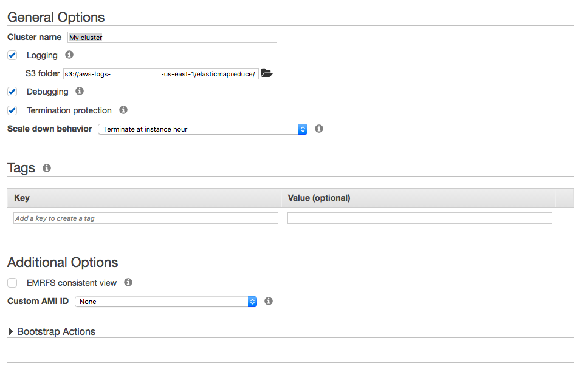
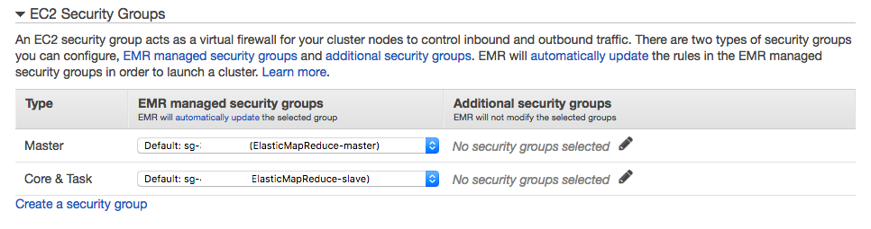

# Spark Challenge - Spark on AWS

At CapTech, we’re focusing all of our efforts around cloud computing. As Amazon Web Services (AWS) is the most popular cloud computing platform by far, we’d like the participants of the Spark Challenge to be versed not only in Spark, but in the Spark setup on AWS as well.

This document will walk you through setting up Spark either through Elastic Map Reduce (EMR) or on an EC2 virtual instance.  This tech challenge assumes you have setup a free tier account with AWS and have a basic understanding of several of its concepts, including creating and using keys for SSH access, setting up security groups to allow SSH from your machine to the host, and setting up EC2 instances.  No previous experience with EMR is assumed.

## EMR Setup

The simplest way to get started is to setup a single node EMR cluster running Apache Spark and Zeppelin.  

Login to the AWS Console.  Under Analytics, click EMR.

Click the Create Cluster button in the upper left-hand corner.  You should be taken to the Create Cluster – Quick Options screen.  Click Go to advanced options.  You will go through four steps:  Software and Steps, Hardware, General Cluster Settings, and Security.

### Step 1: Software and Steps

Select emr-5.7.0 on the Release drop-down menu.  This version of EMR was released in July, 2017.  Also, ensure that the only checkboxes that are ticked are Spark 2.1.1 and Zeppelin 0.7.2.  All other options can be left as defaults.

### Step 2: Hardware

Here, ensure your Network reads (default).  For the EC2 subnet, you’ll probably want to choose the subnet that correlates to Default in us-east-1a (see note below).  Change the Root device EBS volume size to 20 GiB.

For this exercise, we really only need a single-node cluster, and we can use Spot instances to keep costs low.  Remember that Spot instances are significantly cheaper than On-Demand instances, but when their per-hour price rises above your hourly bid price, your instances will be terminated. 

Ensure the Instance count for the Core and Task node groups is zero.  For the Master node, click Spot under Purchasing option.  Hover your mouse over the information (white lowercase “I” in gray circle) icon in the Master node type group to see the current spot prices of the instance type you’ve selected (m3.xlarge is the default and will work fine for the demo).  Go ahead and enter your Maximum bid price at a penny or two greater than the current spot price for the Availability Zone that corresponds with the EC2 Subnet you selected in the drop-down menu above.  Keep in mind that you want to carefully select the lowest priced option, and only bid at most a few cents over the current Price to minimize costs.  Also keep in mind that if the price rises above your Maximum bid price, your cluster will be terminated.  Per AWS rules, you will not be charged for a partial instance hour in which AWS terminates your resources due to the bid price changing.

Click the Next button in the lower right-hand corner to continue to the next screen.

### Step 3: General Cluster Settings

Enter a name for your cluter, and leave all the other options defaulted.  If you have a specific bucket setup for EMR logs, you may enter that in the S3 folder text box under Logging, otherwise a bucket named aws-logs-<YOUR-ACCOUNT-ID>-<REGION-NAME> will be set up for you, and your logs will be stored under a key named elasticmapreduce.

### Step 4: Security

Select an EC2 key pair to use to SSH into the cluster and leave all the other options default under Permissions and Encryption Options.  If this is your first time setting up an EMR cluster, default security roles will be created for you to ensure the nodes can communicate with one another.

Under EC2 Security Groups, select an additional security group for your Master node that will allow you to access the Master node via SSH.  Click the Assign security groups button to return to the Security screen.

Click the Create cluster button in the lower right-hand corner of your screen.  You will be taken to a screen showing the Names, IDs and statuses of any EMR clusters you have setup in the last 30 days.  Your newly-created cluster will appear in the Starting state.

